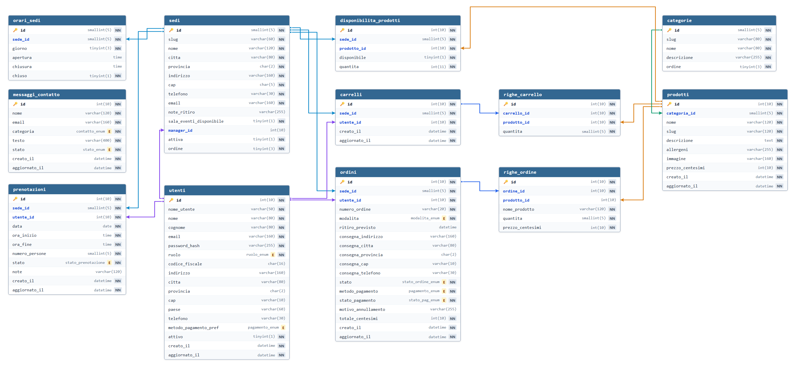

# Smash Burger — Relazione di Progetto

**Università degli Studi di Padova**  
*Dipartimento di Matematica "Tullio Levi-Civita"*  
*Corso di Laurea in Informatica (L31)*  
**Corso di Tecnologie Web — Anno Accademico 2025/2026**

---

  

## Piattaforma web accessibile per la ristorazione veloce e la gestione ordini multi-sede

---

### Componenti del gruppo

| Nominativo | Matricola | Email istituzionale | Ruolo |
|---|---|---|---|
| **Leonardo Soligo** | 2111042 | `leonardo.soligo@studenti.unipd.it` | Referente |
| **Dorde Blagojevic** | 2116424 | `dorde.blagojevic@studenti.unipd.it` | Componente |
| **Alessandro Ravenna** | 2111930 | `alessandro.ravenna@studenti.unipd.it` | Componente |
| **Alessandro Zanier** | 2101091 | `alessandro.zanier@studenti.unipd.it` | Componente |

**Indirizzo web del sito**: `https://tecweb.studenti.math.unipd.it/[DA COMPILARE]`

---

### Credenziali di accesso per il collaudo

| Ruolo utente | Sede di competenza | Nome utente | Password |
|---|---|---|---|
| Cliente | Qualsiasi | `user` | `user` |
| Manager | Sede di Padova | `manager` | `manager` |
| Manager | Sede di Treviso | `manager.treviso` | `manager` |
| Manager | Sede di Vicenza | `manager.vicenza` | `manager` |
| Manager | Sede di Udine | `manager.udine` | `manager` |
| Amministratore | Tutte le sedi | `admin` | `admin` |

---

## Indice

1. [Introduzione e Obiettivi del Progetto](#1-introduzione-e-obiettivi-del-progetto)
2. [Analisi dei Requisiti e Strategia SEO](#2-analisi-dei-requisiti-e-strategia-seo)
3. [Architettura e Progettazione del Sistema](#3-architettura-e-progettazione-del-sistema)
4. [Implementazione Tecnica](#4-implementazione-tecnica)
5. [Accessibilità e Conformità agli Standard](#5-accessibilità-e-conformità-agli-standard)
6. [Metodologia di Collaudo e Risultati dei Test](#6-metodologia-di-collaudo-e-risultati-dei-test)
7. [Ambiente di Sviluppo](#7-ambiente-di-sviluppo)
8. [Organizzazione del Gruppo e Suddivisione del Lavoro](#8-organizzazione-del-gruppo-e-suddivisione-del-lavoro)
9. [Considerazioni Conclusive](#9-considerazioni-conclusive)

---

## 1. Introduzione e Obiettivi del Progetto

La presente relazione descrive le scelte architetturali, tecnologiche e di accessibilità adottate per lo sviluppo del progetto d'esame di Tecnologie Web (Corso di Laurea in Informatica, classe L31, Università degli Studi di Padova) per l'anno accademico 2025-2026.

L'attività presa a modello è la catena di ristorazione veloce "Smash Burger", un'azienda simulata a fini didattici operante con quattro punti vendita nel territorio veneto e friulano (Padova, Treviso, Vicenza e Udine). L'applicazione web sviluppata risponde a una duplice esigenza:
1. offrire ai clienti un canale digitale per consultare i prodotti, inoltrare ordinazioni online (con opzione di asporto o consegna a domicilio) e richiedere la prenotazione della sala eventi;
2. fornire al personale interno (manager locali e amministratore generale) strumenti dedicati per la gestione degli ordini, l'aggiornamento delle scorte, la pianificazione degli orari e il controllo degli accessi.

### 1.1. Panoramica delle funzionalità per ruolo

Le funzionalità offerte sono graduate in funzione del profilo di autorizzazione:

- **Utente non autenticato (Ospite)**: esplora liberamente l'intero catalogo dei prodotti (dettaglio ingredienti, allergeni certificati e prezzi); consulta la scheda informativa delle quattro sedi con orari settimanali, indirizzi e contatti; legge la sezione divulgativa sulla tecnica culinaria dello smash burger; invia richieste di assistenza tramite l'apposito modulo contatti; seleziona il tema grafico preferito (chiaro o scuro).
- **Cliente registrato**: imposta la sede di riferimento; compone e aggiorna il carrello della spesa; conclude l'ordine specificando orario di ritiro o indirizzo di recapito e metodo di pagamento simulato; consulta lo storico personale degli ordini e le relative ricevute; inoltra richieste di prenotazione della sala eventi scegliendo fascia oraria e durata; aggiorna i propri dati personali o cancella il profilo.
- **Manager di sede**: dispone di un'area riservata circoscritta al proprio punto vendita. Può modificare gli orari di apertura e chiusura per ciascun giorno della settimana; abilitare o sospendere la vendita dei singoli prodotti e variarne le quantità a magazzino; valutare le richieste di prenotazione della sala eventi (approvazione o rifiuto); visualizzare e aggiornare lo stato di lavorazione degli ordini; consultare il grafico degli incassi degli ultimi trenta giorni con relativa tabella accessibile.
- **Amministratore generale**: possiede privilegi completi su tutta la piattaforma. Oltre a poter operare su qualsiasi sede, gestisce il catalogo prodotti globale (creazione, aggiornamento, eliminazione vivande e caricamento di nuove immagini); modifica le categorie merceologiche; aggiunge o disattiva punti vendita; consulta i messaggi inviati dagli utenti tramite il modulo contatti; gestisce i permessi e lo stato di attivazione di tutti gli account registrati.

---

## 2. Analisi dei Requisiti e Strategia SEO

### 2.1. Destinatari e scenari d'uso

Il servizio si rivolge principalmente a consumatori compresi nella fascia di età tra i 16 e i 50 anni. L'analisi preliminare evidenzia come l'accesso alla piattaforma avvenga in larga misura tramite dispositivi mobili (smartphone o tablet), spesso in condizioni di mobilità o in prossimità degli orari dei pasti. Da questa constatazione è scaturita la decisione di progettare l'interfaccia con un approccio marcatamente orientato al mobile, semplificando la navigazione, riducendo i passaggi per finalizzare un ordine e garantendo un caricamento rapido anche in presenza di connettività limitata.

La comunicazione nei testi è accessibile e priva di tecnicismi inutili, prestando estremo rigore alla chiara evidenziazione degli allergeni alimentari (glutine, latte, frutta a guscio, uova) e delle alternative vegetariane.

### 2.2. Ottimizzazione per i motori di ricerca (SEO)

L'alberatura del sito e i testi editoriali sono stati concepiti per intercettare ricerche organiche rilevanti, tra cui:
- ricerche correlate al marchio: "smash burger", "smash burger menu", "prezzi smash burger";
- ricerche geolocalizzate: "hamburger padova", "hamburger treviso", "hamburger vicenza", "hamburger udine";
- ricerche su modalità di consumo: "hamburger da asporto padova", "consegna hamburger domicilio";
- ricerche su diete e intolleranze: "hamburger vegetariano padova", "allergeni hamburger";
- ricerche per ricorrenze: "hamburgeria per eventi", "prenotazione sala feste privati".

A supporto dell'indicizzazione sono stati adottati i seguenti accorgimenti tecnici:
- definizione centralizzata di elementi `<title>` e meta tag `description` univoci per ciascuna pagina;
- rigida adozione di marcatori semantici HTML5 rispettando una gerarchia coerente dei titoli;
- predisposizione di una mappa del sito in formato XML (`sitemap.xml`);
- compressione e conversione di tutte le risorse fotografiche nel formato WebP (peso inferiore a 300 KB);
- assenza di librerie esterne o fogli di stile remoti che rallenterebbero l'elaborazione iniziale.

---

## 3. Architettura e Progettazione del Sistema

### 3.1. Modello architetturale

L'applicazione è strutturata secondo i principi architetturali classici del web procedurale:
- **Page Controller**: ogni URL valido fa capo a un controller PHP posizionato nella radice del progetto. Il controller raccoglie la richiesta HTTP, controlla le autorizzazioni dell'utente, richiama le opportune funzioni di dominio e seleziona la vista di destinazione;
- **Transaction Script**: la logica applicativa è organizzata in funzioni pure distribuite in 20 file tematici (gestione ordini, carrello, prenotazioni, catalogo, sicurezza). Ciascuna operazione aziendale viene eseguita in modo isolato e deterministico;
- **Template View**: la presentazione visiva è demandata a viste dedicate prive di logica di interrogazione della base di dati. Le viste ricevono un array di dati già validati e strutturati dal controller e si limitano a generare il markup finale.

L'inclusione sistematica dell'intestazione, del percorso di navigazione (*breadcrumb*), dell'area operativa e del piè di pagina è garantita dalla funzione coordinatrice `mostra_pagina()`.

### 3.2. Organizzazione delle pagine

Il sito conta complessivamente 31 pagine registrate in modo centralizzato all'interno di un file di configurazione unico, suddivise in quattro settori:
- **Area pubblica (14 pagine)**: home page, catalogo menu, scheda singolo prodotto, servizi, presentazione aziendale (chi siamo), elenco sedi, scheda singola sede, modulo contatti, autenticazione, registrazione, privacy policy, dichiarazione di accessibilità, mappa del sito, endpoint per il cambio tema;
- **Area cliente (7 pagine)**: cruscotto personale, modifica dati profilo, carrello della spesa, cassa e checkout, ricevuta di conferma ordine, prenotazione della sala eventi, disconnessione;
- **Area manager (5 pagine)**: elenco ordini di competenza, dettaglio ordine, disponibilità prodotti per sede, orari settimanali di sede, calendario prenotazioni;
- **Area amministratore (5 pagine)**: gestione schede prodotto, gestione categorie, anagrafica e attivazione sedi, gestione messaggi modulo contatti, gestione permessi e ruoli utente.

### 3.3. Gestione dei permessi e delle sessioni

L'accesso alle aree riservate è presidiato da una procedura centralizzata di autorizzazione. All'atto del login, dopo la verifica delle credenziali a fronte degli hash memorizzati nel database, nella sessione dell'utente viene registrato il ruolo attribuito. Ogni controller protetto invoca la funzione di controllo dei privilegi prima di consentire l'accesso alla risorsa: in assenza di autenticazione viene restituita una risposta HTTP 401, mentre in caso di privilegi non adeguati viene emessa una risposta HTTP 403.

I cookie di sessione sono configurati con direttive restrittive (`HttpOnly`, `SameSite=Lax` e flag `Secure` condizionato al protocollo HTTPS) per impedire intercettazioni arbitrarie o accessi via script. Al momento dell'autenticazione viene sistematicamente eseguita la rigenerazione dell'ID di sessione, neutralizzando gli attacchi di fissazione.

### 3.4. Struttura della base di dati

La persistenza delle informazioni è affidata al motore relazionale MariaDB (versione 10.6). Lo schema si articola in 12 tabelle relazionali, regolate da 15 vincoli di integrità referenziale (*foreign key*). Tutti i valori economici sono memorizzati come numeri interi espressi in centesimi di euro (tipo `INT UNSIGNED`), scongiurando le imprecisioni di calcolo tipiche dei tipi a virgola mobile.

Le tabelle create sono:
- **utenti**: anagrafica degli account, credenziali cifrate, ruolo e dati per la consegna;
- **sedi**: elenco dei quattro locali con indirizzo, recapiti e identificativo del manager assegnato;
- **orari_sedi**: fasce orarie settimanali con vincolo di unicità su sede e giorno;
- **categorie**: classificazione merceologica delle vivande con ordinamento personalizzabile;
- **prodotti**: catalogo delle preparazioni alimentari con denominazione, descrizione, allergeni, prezzo e percorso immagine;
- **disponibilita_prodotti**: matrice di collegamento tra sedi e prodotti, con quantità a magazzino e vincolo `CHECK (quantita >= 0)`;
- **carrelli** e **righe_carrello**: carrelli di spesa temporanei associati all'utente e alla sede selezionata;
- **ordini** e **righe_ordine**: ordini confermati con indicazione dello stato di avanzamento, della modalità (ritiro o domicilio), del recapito e storicizzazione puntuale del prezzo degli articoli acquistati;
- **prenotazioni**: richieste di occupazione della sala eventi con data, ora di inizio, ora di fine e stato di approvazione;
- **messaggi_contatto**: richieste inviate dagli utenti tramite il modulo contatti, classificate per argomento e stato di evasione.

  

### 3.5. Gestione della concorrenza

Particolare cura è stata riservata a due scenari critici di concorrenza sui dati:
1. **Scarico scorte a magazzino**: all'atto del checkout l'aggiornamento delle quantità disponibili avviene all'interno di una transazione SQL atomica con clausola condizionale (`UPDATE disponibilita_prodotti SET quantita = quantita - :q WHERE sede_id = :s AND prodotto_id = :p AND quantita >= :q`). Se anche una sola riga non soddisfa la condizione, la transazione fallisce e l'ordine viene respinto, evitando vendite eccedenti la reale disponibilità fisica.
2. **Sovrapposizione delle prenotazioni**: prima di registrare una prenotazione per la sala eventi, una query transazionale verifica l'assenza di intervalli orari sovrapposti nella medesima sede e data tra le prenotazioni già approvate o in attesa.

---

## 4. Implementazione Tecnica

### 4.1. Dichiarazione sull'uso di immagini generate

L'attività commerciale descritta è interamente simulata a fini didattici. Le immagini illustrative dei panini, delle bevande, dei contorni, delle facciate dei locali e delle sezioni editoriali sono state **generate tramite strumenti di intelligenza artificiale**, al fine di conferire al sito un'estetica omogenea e coordinata. Tutte le risorse grafiche sono state successivamente ritagliate nelle proporzioni opportune per il layout, convertite nel formato compresso WebP (garantendo un peso per ciascun file inferiore alla soglia di 300 KB) e corredate da descrizioni testuali alternative (`alt`) che ne illustrano fedelmente il contenuto visivo.

### 4.2. Struttura e semantica del markup (HTML5)

Le pagine sono scritte in HTML5 rispettando la sintassi XML:
- chiusura esplicita di ogni elemento, compresi gli elementi vuoti;
- valori degli attributi sempre racchiusi tra virgolette;
- attributi booleani dichiarati in forma esplicita (come `required="required"`);
- inclusione dei namespace e dell'attributo linguistico nella radice: `<html xmlns="http://www.w3.org/1999/xhtml" lang="it" xml:lang="it">`.

Tutti i documenti adottano marcatori semantici per definire chiaramente le sezioni (`<header>`, `<nav>`, `<main>`, `<section>`, `<article>`, `<footer>`), supportando la navigazione per landmark.

### 4.3. Organizzazione dei fogli di stile (CSS)

La presentazione è articolata su tre fogli di stile distinti, collegati con l'attributo `media` adeguato:
- `stile.css`: foglio principale contenente il reset di base, la definizione delle variabili cromatiche e dimensionali, i layout dei componenti e la gestione delle modalità chiara e scura;
- `mobile.css`: foglio dedicato ai dispositivi con larghezza della finestra fino a 48 em (768 pixel), collegato con `media="screen and (max-width: 48em)"`;
- `stampa.css`: foglio per la stampa cartacea, collegato con `media="print"`.

Nello sviluppo del CSS sono state seguite regole precise:
- assenza di stili inline nell'HTML;
- impiego di variabili CSS (*custom properties*) all'interno di `:root` per centralizzare i colori, i margini e le ombreggiature;
- adozione combinata di Flexbox e CSS Grid, limitando l'annidamento per non gravare sulle prestazioni di calcolo del browser;
- disattivazione delle transizioni visive e animazioni in presenza della preferenza di sistema per la riduzione del movimento (`@media (prefers-reduced-motion: reduce)`).

### 4.4. Tavolozze cromatiche e verifica dei contrasti

I colori adottati riprendono le tonalità tipiche dei condimenti di una classica hamburgeria americana: senape, ketchup e cetriolini sottaceto. Nelle tabelle seguenti vengono riepilogati i colori dei due temi con i relativi campioni grafici:

#### Modalità Chiara

| Ruolo visivo | Variabile CSS | Campione | Codice HEX |
|---|---|:---:|---|
| Sfondo della pagina | `--sfondo` |  | `#faf7f2` |
| Superficie delle schede | `--superficie` |  | `#fffdf9` |
| Superficie alternativa | `--superficie-alternativa` |  | `#eee7dc` |
| Testo principale | `--testo` |  | `#1a1a1a` |
| Accento caldo (senape) | `--senape` |  | `#9c6f00` |
| Colore di azione (ketchup) | `--ketchup` |  | `#b3181f` |
| Colore di successo (cetriolini) | `--cetriolini` |  | `#3f6b24` |
| Bordi e cornici | `--bordo` |  | `#d8cfc2` |
| Collegamenti visitati | `--visitato` |  | `#61208f` |

#### Modalità Scura

| Ruolo visivo | Variabile CSS | Campione | Codice HEX |
|---|---|:---:|---|
| Sfondo della pagina | `--sfondo` |  | `#171614` |
| Superficie delle schede | `--superficie` |  | `#22201d` |
| Superficie alternativa | `--superficie-alternativa` |  | `#2d2a26` |
| Testo principale | `--testo` |  | `#f2ece4` |
| Accento caldo (senape) | `--senape` |  | `#e8a100` |
| Colore di azione (ketchup) | `--ketchup` |  | `#f0555a` |
| Colore di successo (cetriolini) | `--cetriolini` |  | `#86bd4d` |
| Bordi e cornici | `--bordo` |  | `#413d37` |
| Collegamenti visitati | `--visitato` |  | `#d8adff` |

Tutte le coppie testo/sfondo sono state collaudate con strumenti appositi, registrando un rapporto di contrasto minimo pari a 5.02:1, ampiamente superiore al valore limite prescritto dalle WCAG 2.1 AA (4.5:1 per il testo normale e 3:1 per il testo grande).

### 4.5. Foglio di stile per la stampa

Il foglio `stampa.css` converte l'aspetto visivo in un formato orientato al risparmio di inchiostro (*PrintFriendly*):
- impostazione di uno sfondo interamente bianco e testo nero ad alto contrasto;
- occultamento sistematico di tutti i componenti di navigazione (menu principale, link rapidi, piè di pagina) e di tutti i controlli interattivi (pulsanti, form di ricerca, commutatori);
- rimozione delle ombreggiature nette e dei bordi decorativi;
- linearizzazione del layout su una colonna con margini fissati a 2 cm mediante la regola `@page`.

### 4.6. Tipografia

Il carattere tipografico adottato è **Archivo**, un carattere sans-serif grottesco moderno di grande impatto, rilasciato con licenza Open Font License. I relativi file sorgente (`.ttf`) sono inclusi localmente nel progetto in tre varianti di peso (normale, grassetto e nero) e richiamati con la direttiva `font-display: swap`. La catena di ripiego (*font fallback*) include caratteri ampiamente diffusi sui principali sistemi operativi: `"Archivo", "Helvetica Neue", Arial, sans-serif`.

### 4.7. Comportamento e Progressive Enhancement (JavaScript)

Il comportamento dinamico lato client è gestito da un singolo file JavaScript (`script.js`) strutturato in modalità rigorosa (`'use strict'`) e privo di dipendenze da framework esterni. L'applicazione rispetta il principio del **Progressive Enhancement**: ogni funzionalità essenziale del sito (consultazione del catalogo, emissione ordini, gestione delle prenotazioni e pannello di controllo) risulta pienamente operativa anche con JavaScript completamente disabilitato nel browser.

Lo script interviene su tre aspetti:
1. **Pulsante torna su**: viene reso visibile dopo che lo scorrimento supera una determinata quota; al click scorre la vista verso la sommità della pagina e sposta contestualmente il focus da tastiera sull'ancora iniziale (`#inizio`), preservando l'accessibilità per chi naviga senza puntatore;
2. **Sottomissione asincrona dei form (AJAX)**: i moduli abilitati inviano i dati mediante le API native `fetch` e aggiornano la sezione centrale della pagina senza richiedere il ricaricamento dell'intero documento; in caso di fallimento della richiesta o problemi di rete, il modulo esegue un ripiego automatico sottomettendosi nel modo convenzionale;
3. **Gestione dinamica del pagamento**: adatta i campi visibili relativi all'indirizzo in funzione della modalità scelta (ritiro in sede o consegna a domicilio) manipolando attributi dati che pilotano le regole CSS, senza alterare stili inline.

### 4.8. Misure di sicurezza applicativa

La protezione della piattaforma comprende difese su molteplici livelli:
- **SQL Injection**: utilizzo sistematico di istruzioni preparate PDO con parametri nominati per qualsiasi query contenente valori provenienti dall'esterno;
- **Cross-Site Scripting (XSS)**: sanificazione sistematica dei dati presentati a video tramite una funzione helper che invoca `htmlspecialchars()` con codifica UTF-8 e flag `ENT_QUOTES | ENT_SUBSTITUTE | ENT_HTML5`;
- **Cross-Site Request Forgery (CSRF)**: inclusione in ogni form di modifica di un token pseudo-casuale generato crittograficamente con `random_bytes()`, convalidato all'arrivo tramite la funzione a tempo costante `hash_equals()`;
- **Protezione delle password**: memorizzazione esclusiva degli hash calcolati mediante l'algoritmo sicuro bcrypt (`password_hash()`);
- **Sicurezza dei caricamenti**: verifica rigorosa del tipo MIME reale delle immagini tramite `finfo_file()` e inibizione dell'esecuzione di file PHP all'interno della cartella di upload tramite direttive server;
- **Intestazioni di protezione HTTP**: configurazione del server web con intestazioni di Content Security Policy restrittive (prive di unsafe-inline o unsafe-eval), X-Frame-Options (SAMEORIGIN) contro il clickjacking e divieto di directory listing (`Options -Indexes`).

### 4.9. Pagine di errore dedicate

La piattaforma gestisce gli errori di navigazione e le eccezioni del server mediante pagine personalizzate per i codici HTTP 401, 403, 404 e 500, configurate con percorsi relativi nel file `.htaccess`. Ognuna di queste pagine presenta una grafica coordinata, un messaggio esplicativo comprensibile e la navigazione completa del sito, evitando che l'utente rimanga bloccato in una schermata cieca.

---

## 5. Accessibilità e Conformità agli Standard

L'obiettivo progettuale costante è stato il soddisfacimento delle linee guida di accessibilità WCAG 2.1 al livello AA.

### 5.1. Interventi per la navigazione e la struttura

- **Collegamento rapido iniziale**: collocazione di un link "Vai al contenuto" (*skip link*) come primissimo elemento del corpo pagina, permettendo a chi naviga da tastiera di saltare l'intestazione e raggiungere subito l'area dei contenuti;
- **Assenza di link circolari**: la voce di navigazione corrispondente alla pagina corrente non è collegata ipertestualmente ma esposta come elemento testuale distinto, marcato con l'attributo semantico `aria-current="page"`;
- **Percorso di navigazione (*breadcrumb*)**: indicazione chiara della gerarchia della pagina corrente rispetto alla home;
- **Etichettatura form**: associazione univoca ed esplicita tra etichette visibili (`<label for="...">`) e controlli di input; raggruppamento logico dei campi tramite `<fieldset>` e `<legend>`;
- **Tabelle accessibili**: impiego di `<caption>` per la descrizione del contenuto della tabella e attributi `scope="col"` e `scope="row"` per associare le celle di intestazione ai dati;
- **Grafico degli incassi accessibile**: il disegno vettoriale SVG del grafico degli incassi a 30 giorni è accompagnato da una tabella riassuntiva dei medesimi valori numerici, garantendone la completa comprensione anche in assenza di percezione visiva;
- **Messaggi di stato chiari**: gli avvisi di errore o di conferma sono identificati dall'attributo `role="status"` e recano un'etichetta testuale iniziale ("Errore:" o "Fatto:") per non demandare l'informazione alla sola percezione cromatica.

### 5.2. Adattamenti per screen reader

- **Attributo di lingua sui termini stranieri**: applicazione mirata di `lang="en"` sui nomi dei panini e delle pietanze in lingua inglese (come *Cheeseburger*, *Bacon Burger*, *Chicken Wings*, *In-N-Out Style*), evitando distorsioni fonetiche nella sintesi vocale;
- **Marcatura delle sigle**: esplicitazione del significato di acronimi e abbreviazioni mediante il marcatore `<abbr>` (ad esempio per le sigle CAP e WCAG);
- **Icone decorative nascoste**: apposizione dell'attributo `aria-hidden="true"` su tutte le icone SVG di contorno per escluderle dal flusso di lettura delle tecnologie assistive.

### 5.3. Fruizione fluida su dispositivi diversi

L'impaginazione del sito è interamente fluida, calibrata tramite unità relative (`em`, `rem`, percentuali). In tutte le pagine e a qualunque risoluzione (a partire dalla larghezza minima di 320 pixel) non si verifica alcuno scorrimento orizzontale imprevisto. La disposizione a colonna singola per i dispositivi mobili entra in funzione automaticamente sotto i 48 em (768 pixel).

---

## 6. Metodologia di Collaudo e Risultati dei Test

La conformità tecnica e l'accessibilità del sito sono state verificate combinando strumenti automatici e approfondite sessioni di prova manuale.

### 6.1. Strumenti di verifica automatica

- **W3C Nu Html Checker**: collaudo della validità del markup HTML5 su tutte le pagine pubbliche e riservate del sito, con esito di zero errori;
- **W3C CSS Validation Service**: verifica formale della conformità dei tre fogli di stile (`stile.css`, `mobile.css`, `stampa.css`) tramite le relative API, riscontrando zero errori di sintassi;
- **xmllint**: controllo della corretta strutturazione XML su tutti i documenti HTML5 prodotti;
- **Pa11y**: scansione dell'accessibilità configurata secondo lo standard WCAG 2.1 AA, eseguita su ogni pagina sia in modalità ospite sia autenticandosi con i tre diversi ruoli di prova;
- **Google Lighthouse**: verifica delle metriche prestazionali, di accessibilità, conformità alle buone pratiche e SEO, con punteggi superiori alla soglia di 90 su tutte le sezioni;
- **WAVE Web Accessibility Evaluation Tool** e **Silktide Accessibility**: estensioni browser utilizzate continuativamente durante lo sviluppo per il controllo visivo dei contrasti, delle etichette e della gerarchia delle intestazioni.

### 6.2. Controlli manuali

- navigazione completa da tastiera dell'intera interfaccia mediante i tasti Tab, Invio e Spazio, accertando la costante visibilità del focus e la coerenza dell'ordine di tabulazione;
- test con JavaScript disattivato su tutti i percorsi operativi (consultazione del catalogo, ordinazione, checkout, cambio tema e pannello di controllo);
- invio di moduli con campi incompleti, errati o contenenti caratteri speciali, accertando la tempestività e la chiarezza dei messaggi di errore e il mantenimento dei dati validi inseriti;
- simulazione di stampa fisica e su file PDF di ricevute e pagine informative;
- collaudo visivo a risoluzioni multiple (320px, 375px, 768px, 1024px, 1440px) per verificare l'adattabilità dei layout;
- compatibilità con i principali browser: Google Chrome, Mozilla Firefox, Microsoft Edge, Apple Safari e Opera;
- compatibilità con diversi sistemi operativi: Microsoft Windows, Linux (Ubuntu), Android e iOS.

### 6.3. Automazione dei controlli (Continuous Integration)

Per preservare la qualità del codice durante lo sviluppo è stata allestita una pipeline di Continuous Integration tramite GitHub Actions. A ogni aggiornamento del codice la procedura avvia un ambiente containerizzato dedicato ed esegue in successione:
1. la validazione sintattica HTML5 con il validatore ufficiale del W3C e la verifica della conformità XML;
2. la validazione dei tre fogli di stile CSS mediante le API del W3C;
3. l'audit di accessibilità con Pa11y sulle pagine pubbliche e su quelle private (autenticandosi automaticamente con le credenziali di prova dei ruoli cliente, manager e amministratore);
4. la valutazione prestazionale e qualitativa con Google Lighthouse;
5. il deploy automatizzato dei sorgenti sul server universitario attraverso un canale cifrato SSH, con correzione e verifica dei permessi di lettura ed esecuzione sui file.

### 6.4. Valutazione dei falsi positivi

I validatori automatici non hanno evidenziato criticità o violazioni dello standard. Le uniche segnalazioni riscontrate dal validatore CSS hanno natura informativa e riguardano l'impiego delle custom properties (`--nome-variabile`), le quali costituiscono una funzionalità standard del CSS moderno, pienamente supportata e conforme.

### 6.5. Collaudo con screen reader

L'esperienza di fruizione con tecnologie assistive è stata testata manualmente tramite lo screen reader open-source **NVDA** in abbinamento ai browser Mozilla Firefox e Google Chrome. I test hanno confermato:
- la corretta lettura del testo associato allo skip link iniziale e l'effettivo spostamento del focus all'area centrale;
- l'esatta enunciazione dei ruoli semantici e degli stati dei controlli interattivi;
- l'adeguata lettura strutturata delle tabelle con annuncio delle intestazioni di colonna e di riga;
- la corretta pronuncia dei termini in lingua inglese grazie agli attributi di lingua;
- la tempestiva ricezione degli avvisi di esito dei moduli, annunciati correttamente come messaggi di stato.

---

## 7. Ambiente di Sviluppo

Per agevolare lo sviluppo collaborativo e garantire la piena riproducibilità del comportamento del server universitario d'esame, è stato allestito un ambiente locale containerizzato tramite Docker. La configurazione replica fedelmente lo stack tecnologico di produzione:
- container web basato su PHP versione 8.1 con server Apache e moduli `rewrite`, `headers` e `deflate`;
- container per la base di dati basato su MariaDB versione 10.6 con volume persistente e script di auto-popolamento all'avvio.

---

## 8. Organizzazione del Gruppo e Suddivisione del Lavoro

Il carico di lavoro è stato ripartito in modo equilibrato tra i quattro componenti del gruppo, consentendo a ciascuno di partecipare sia alla stesura del markup e dello stile, sia allo sviluppo delle funzioni PHP e all'esecuzione dei test di qualità.

### 8.1. Ripartizione dei compiti

- **Leonardo Soligo (referente)**:
  - Coordinamento generale del progetto e definizione delle convenzioni architetturali;
  - HTML/CSS: pagine istituzionali e catalogo (Home page, Menu, Dettaglio prodotto, Servizi);
  - PHP/JavaScript: controller e logica applicativa del catalogo e dei servizi;
  - Base di dati: modellazione concettuale e logica dello schema relazionale;
  - Testing e validazione: controlli di accessibilità con WAVE, Silktide e test con NVDA;
  - Stesura e revisione della relazione tecnica.

- **Dorde Blagojevic**:
  - HTML/CSS: pagine informative e di supporto (Chi siamo, Sedi, Scheda sede, Modulo contatti, Privacy policy, Dichiarazione di accessibilità);
  - PHP/JavaScript: gestione dell'invio messaggi di contatto e presentazione delle sedi;
  - Base di dati: definizione dei vincoli di integrità referenziale e indici di ricerca;
  - Testing e validazione: controlli formali con validatore W3C (HTML5 e CSS) e test con NVDA;
  - Stesura e revisione della relazione tecnica.

- **Alessandro Ravenna**:
  - HTML/CSS: flusso carrello, cassa e checkout, ricevuta ordine, area personale, prenotazione sala;
  - PHP/JavaScript: logica transazionale del checkout, gestione concorrente delle scorte a magazzino e controllo anti-sovrapposizione prenotazioni;
  - Base di dati: definizione query complesse e popolamento iniziale dei dati di prova;
  - Testing e validazione: verifiche di usabilità su mobile, test con JavaScript disabilitato e collaudo con NVDA;
  - Stesura e revisione della relazione tecnica.

- **Alessandro Zanier**:
  - HTML/CSS: sezioni del pannello gestionale multilivello (Gestione ordini, Gestione prodotti e scorte, Gestione categorie, Gestione sedi e orari, Gestione utenti);
  - PHP/JavaScript: autenticazione, gestione delle sessioni con cookie protetti, controllo accessi per ruoli e generazione del grafico SVG;
  - Infrastruttura e automazione: configurazione della pipeline di Continuous Integration e script di deploy;
  - Testing e validazione: audit con Pa11y, verifiche prestazionali con Google Lighthouse e test con NVDA;
  - Stesura e revisione della relazione tecnica.

---

## 9. Considerazioni Conclusive

Il sito web di "Smash Burger" è stato realizzato interamente senza l'impiego di librerie o framework preconfezionati (come Bootstrap, Tailwind o jQuery), privilegiando la padronanza delle tecnologie native del web (HTML5 semantico conforme a XML, CSS3 puro con custom properties e PHP 8.1 procedurale con PDO). L'unica risorsa di terze parti integrata è il carattere tipografico Archivo, incluso localmente nel progetto con licenza Open Font License per evitare qualsiasi dipendenza da CDN esterne.

L'adozione rigorosa del Progressive Enhancement garantisce che la piattaforma mantenga la totalità delle proprie funzioni operative indipendentemente dalle caratteristiche del dispositivo, dalle tecnologie assistive utilizzate o dallo stato di abilitazione di JavaScript, offrendo un'esperienza d'uso veloce, trasparente e pienamente accessibile.
